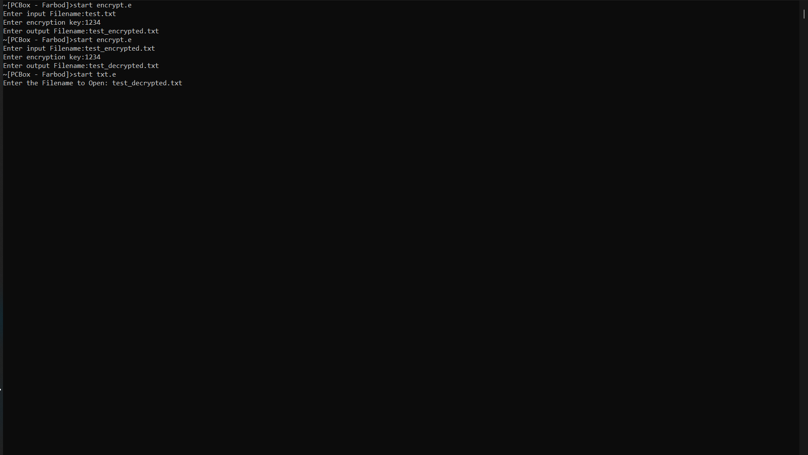
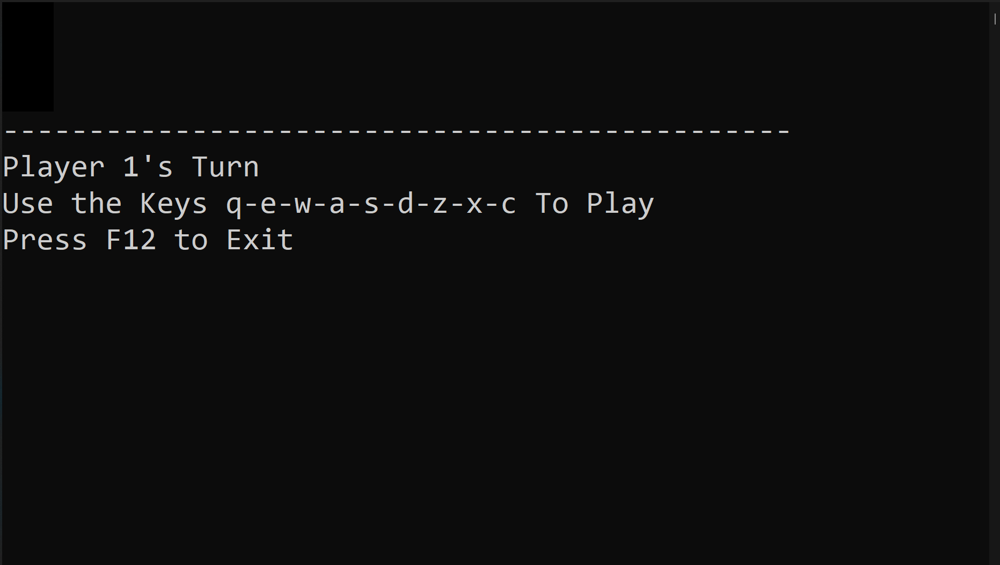
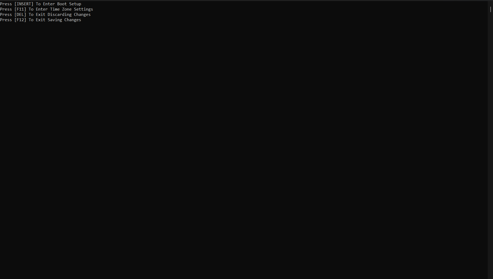
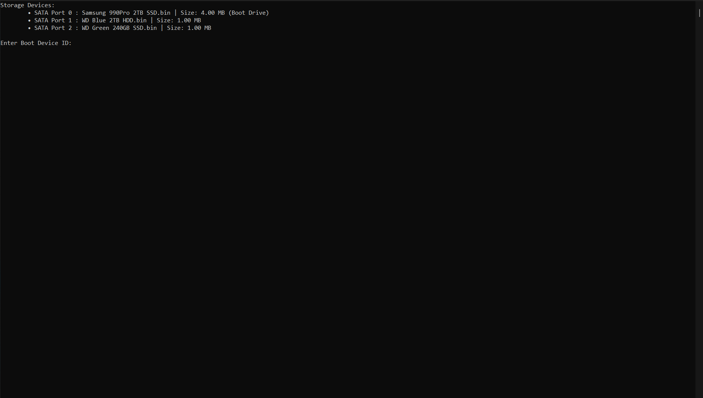
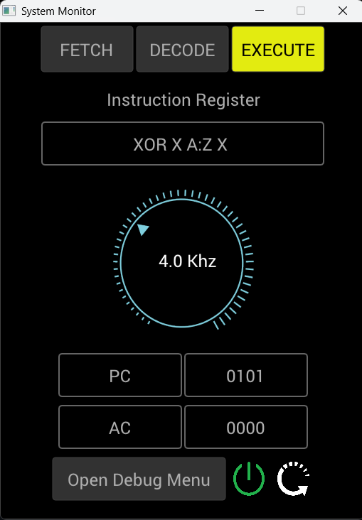

# Computer Simulation, Written in C

This is a simple computer simulation, with a proprietary machine code language which the programs are written in.

The project mainly consists of two seperate parts, which comminucate using windows.h's file mapping:

1. The computer itself
2. System monitor GUi
## The Computer Itself
### Main Components
#### CPU
- Has the registers IR, PC, SP, AC, MAR, MDR, U, V, X, Y, Z
- Reads instructions from systemMemory (Defined in Memory.c)
- Parses each instruction using a hashing function (Defined in headers.h)
- Handles the shared memory (hMapFile)
- Follows a three stepped procedure: FETCH, DECODE, EXECUTE
- Will wait a pre-defined amount of time on each step, simulating a clock frequency.
#### Memory
- Contains two seperate channels
- Each channel is a global variable defined in Memory.c
- The first channel is systemMemory, Reserved for CPU instructions
- The second channel is userMemory, which can be accesed via memory related commands, MDR, and MAR registers.
```c
typedef struct systemRAM {
	unsigned long instruction;
	char data[SYNTAX_LIMIT][STRING_SIZE];
	int type;
	bool isFree;
} systemRAM_t;
typedef struct userRAM {
	int data;
	bool isFree;
} userRAM_t;
```
#### Disk Drive
- Binary Data is stored on a .bin file, which will be our computer's virtual disk drive
- An extremely simple "filesystem" is implemented to handle reading and writing:
	- The .bin file is divided into a given number of sectors
	- Each sector contains one file
	- The first sector is reserved for metadata
	- File metadata:
		```c
		typedef struct metadata {
			char filename[FILENAME_SIZE];
			int size;
			long start_sector;
			bool isFree;
		} metadata_t;
		```
	- Drive metadata_t:
		```c
		typedef struct disk_info {
			long totalSize;
			long sectorSize;
			long disk_info_len;
		} disk_info_t;
		```
- Drive metadata is stored in a seperately allocated memory, synced with the .bin file on shutdown.
#### Motherboard (BIOS, POST, etc)
- Lists .bin files present in the running directory on startup
- Selects the first available drive from a config file (.bootdev)
- Timezones can be configured from the SETUP menu, and used in the machine code (GETTIMEZONE)
- Will wait for monitor's turn on command
### Instructions
- Below is a table of each instruction's syntax, and parameters.
- R1, R2, R3 are given registers (X, Y, Z, MAR, MDR, etc)

| Command      | Parameter 1       |  Parameter 2      | Parameter 3       | Description                                                |
|--------------|-------------------|-------------------|-------------------|------------------------------------------------------------|
| OR           | R1 (src1)         | R2 (src2)         | R3 (dest)         | -                                                          |
| AND          | R1 (src1)         | R2 (src2)         | R3 (dest)         | -                                                          |
| NOT          | R1 (dest)         | -                 | -                 | -                                                          |
| XOR          | R1 (src1)         | R2 (src2)         | R3 (dest)         | Bitwise XOR                                                |
| NAND         | R1 (src1)         | R2 (src2)         | R3 (dest)         | -                                                          |
| NOR          | R1 (src1)         | R2 (src2)         | R3 (dest)         | -                                                          |
| BITAND       | R1 (src1)         | R2 (src2)         | R3 (dest)         | Bitwise AND                                                |
| BITOR        | R1 (src1)         | R2 (src2)         | R3 (dest)         | Bitwise OR                                                 |
| FOPEN        | R1 or filename    | -                 | -                 | Cache (S, A) or direct string                              |
| MKF          | R1 or filename    | -                 | -                 | Cache (S, A) or direct string                              |
| RM           | R1 or filename    | -                 | -                 | Cache (S, A) or direct string                              |
| RENAME       | R1 or filename    | R2 or filename    | -                 | Cache (S, A) or direct string                              |
| RNC          | R1 (n)            | R2 (dest)         | -                 | Read nth byte from opened file                             |
| WNC          | R1 (n)            | R2 (char)         | -                 | Write to nth byte of opened file                           |
| FEX          | R1 or filename    | R1 (dest)         | -                 | File exists?                                               |
| GETFILEINFO  | R1 (n)            | R2 (dest)         | -                 | Write nth file name to cache                               |
| ADD          | R1 (src1)         | R2 (src2)         | R3 (dest)         | -                                                          |
| SUB          | R1 (src1)         | R2 (src2)         | R3 (dest)         | R3 = R1 - R2                                               |
| DIV          | R1 (src1)         | R2 (src2)         | R3 (dest)         | R3 = R1 / R2                                               |
| MUL          | R1 (src1)         | R2 (src2)         | R3 (dest)         | -                                                          |
| LO           | R1 (src1)         | R2 (src2)         | R3 (dest)         | Left over (%)                                              |
| INC          | R1 (dest)         | -                 | -                 | Increment                                                  |
| DEC          | R1 (dest)         | -                 | -                 | Decrement                                                  |
| NEG          | R1 (dest)         | -                 | -                 | Negate                                                     |
| COPY         | R1 (src)          | -                 | -                 | Copy memory to MAR                                         |
| FLUSH        | -                 | -                 | -                 | Free MAR                                                   |
| CLEAR        | -                 | -                 | -                 | Free all user memory                                       |
| MFREE        | R1 (dest)         | -                 | -                 | Check if MAR is free                                       |
| MEMWRITE     | -                 | -                 | -                 | Write MDR into MAR                                         |
| PMEMWRITE    | -                 | -                 | -                 | Write MDR into SP                                          |
| MEMLOAD      | -                 | -                 | -                 | Read MAR into MDR                                          |
| PMEMLOAD     | -                 | -                 | -                 | Read SP into MDR                                           |
| REGSET       | R1 (dest)         | x                 | -                 | Write x into R1                                            |
| REGCOPY      | R1 (src)          | R2 (dest)         | -                 | Copy register values                                       |
| EQ           | R1 (src1)         | R2 (src2)         | R3 (dest)         | -                                                          |
| HIGHER       | R1 (src1)         | R2 (src2)         | R3 (dest)         | -                                                          |
| LOWER        | R1 (src1)         | R2 (src2)         | R3 (dest)         | -                                                          |
| SHIFTFORWARD | R1 (src)          | R2 (n)            | R3 (dest)         | Bitwise shift forward                                      |
| SHIFTBACK    | R1 (src)          | R2 (n)            | R3 (dest)         | Bitwise shift backward                                     |
| INPUT        | R1 (dest)         | -                 | -                 | Input ASCII from stdin                                     |
| OUTPUT       | R1 (src)          | -                 | -                 | Output ASCII to stdout + CONST                            |
| GETKEY       | R1 (dest)         | -                 | -                 | Wait for keypress                                          |
| CLS          | -                 | -                 | -                 | Clear screen                                               |
| GOTO         | label             | -                 | -                 | Jump to label (:label)                                     |
| CRUN         | R1                | cmd               | -                 | If R1, run cmd                                             |
| SHUTDOWN     | -                 | -                 | -                 | Shutdown system                                            |
| GETTIME      | R1 (dest)         | -                 | -                 | Seconds since EPOCH                                        |
| GETTIMEZONE  | R1 (dest)         | -                 | -                 | Seconds offset from GMT                                    |
| CONST        | C(n)              | str               | -                 | Define constant string                                     |
| ERR          | E(n)              | str               | -                 | Define error (#: int, $: str)                              |
| CERR         | E(n)              | R1                | R2                | Print error                                                |
| PROC         | procname:         | -                 | -                 | Start procedure                                            |
| ENDPROC      | -                 | -                 | -                 | End procedure                                              |
| RUNPROC      | procname          | -                 | -                 | Run procedure                                              |
| ENABLEECHO   | -                 | -                 | -                 | Enable input echo                                          |
| DISABLEECHO  | -                 | -                 | -                 | Disable input echo                                         |
| LOADTOMEMORY | R1 or filename    | -                 | -                 | Load executable into SYSTEM_RAM                            |
| UNLOADFROMMEMORY | R1 or filename | -                | -                 | Unload last executable from SYSTEM_RAM                     |
| CURSORUP     | -                 | -                 | -                 | Move cursor up                                             |
| CURSORDOWN   | -                 | -                 | -                 | Move cursor down                                           |
| DRAWPIXEL    | R1 (r)            | R2 (g)            | R3 (b)            | Draw RGB pixel                                             |
| STARTSTREAM  | -                 | -                 | -                 | Start portaudio stream                                     |
| STOPSTREAM   | -                 | -                 | -                 | Stop portaudio stream                                      |
| SETBPM       | R1 (src)          | -                 | -                 | Set BPM                                                    |
| PLAYNOTE     | R1 (freq)         | -                 | -                 | Play note                                                  |
| DEBUG        | -                 | -                 | -                 | Pause execution                                            |

### Audio Playback (MIDI notes)
- Uses portaudio
- Creates a square wave with a gievn frequency and plays it
```c
void play_note(unsigned char note, unsigned char duration) {
	int *buffer;
	int beat_duration = 60000 / bpm;
	int frames = AUDIO_SAMPLE_RATE * duration * beat_duration / 1000;
	buffer = (int *)malloc(frames * sizeof(int));
	if (note == 0) {
		memset(buffer, 0, frames * sizeof(int)); //Silence
	} else {
		int freq = midiToFreq(note);
		squareWaveGenerate(buffer, frames, freq);
	}
	Pa_WriteStream(audio_stream, buffer, frames);
	free(buffer);
}
```
## System Monitor
A seperate process, watching and controlling the Computer remotely.

Uses nuklear immediate mode GUI library, and windows's fileMap to comminucate to the Computer.
- Features
	- Main Menu:
		- Execution step visualizer (FETCH, DECODE, EXECUTE)
		- Clock visualizer (Blinking knob in the center)
		- Clock frequency knob in the middle
		- Live display of PC & AC's values
		- Power buttons (Shutdown & Restart)
	- Debug Menu:
		- Watch Register value
		- 3 Display types (Hexadecimal, ASCII Character, Decimal)
## Programs
1. OS.e (The operating system itself)
	- Simple Login Panel
	- Parses Commands Using a hashMap
2. encrypt.e
	- XOR file encryption with a pre-defined key
	- Reads a file byte per byte
	- Each byte is loadaed into a register, XORed with the nth character of the key, and loaded into the RAM
	- 4 Bytes are stored in a single memory address (int32_t)
3. Image_Effects.e
	- Raw image data is read into the RAM
	- One of the 3 effects (Grayscale, Negative, Color Correction) could be selected
	- The edited RGB values are written into a new file
4. Image_Viewer.e
	- Raw image data is read into 3 registers
	- Each pixel is drawn using the DRAWPIXEL instruction
	- At the end of each n pixels a newline terminator (\n) is printed
5. Music.e
	- Note data is read from a .note file (Groups of 2 bytes, note ID and duration)
	- Each note is played using the PLAYNOTE instruction
6. Numberguessgame.e
	- A random number is generated using a pre-given seed, and EPOCH time (GETTIME instruction)
	- The player proceeds to guess a number in the 0~1000 range until he guesses it correctly
7. Texteditor.e
	- Simple text editor written using the CURSORUP, CURSORDOWN instructions and the backspace character (\b)
8. Tictactoe.e
	- 2 Player Tic-Tac-Toe game written using the DRAWPIXEL command (Red and Blue pixels)
	- Each player can play their turn using keyboard keys:
		```
		            _ _
		Q-W-E      |_|_|
		A-S-D  ->  |_|_| 
		Z-X-C      |_|_|
		```
- More programs will be written for the system in the future, hopefully :P
## Screenshots
### Programs
#### Os.e


#### Img.e


#### Imgfx.e


#### txt.e

#### encrypt.e


#### tictactoe.e


#### numberguessgame.e

#### music.e
[](Screenshots/MUSIC/music.mp4)
### Bios





### Monitor



## Dependencies
#### portaudio, glfw, glew, nuklear, nuklear_glfw, windows.h, stb_image


